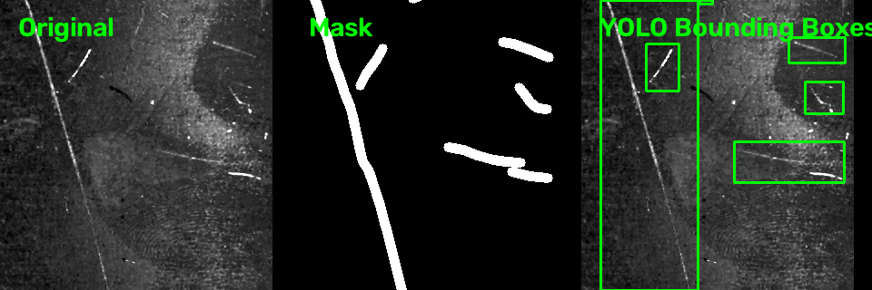
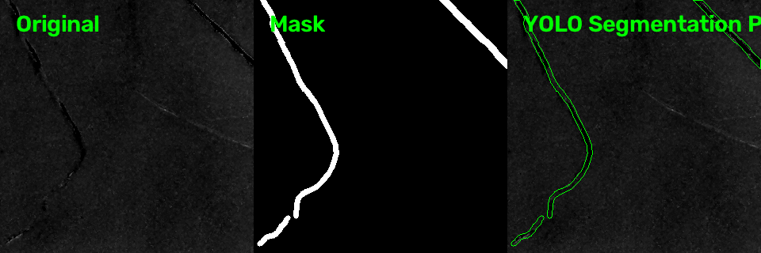
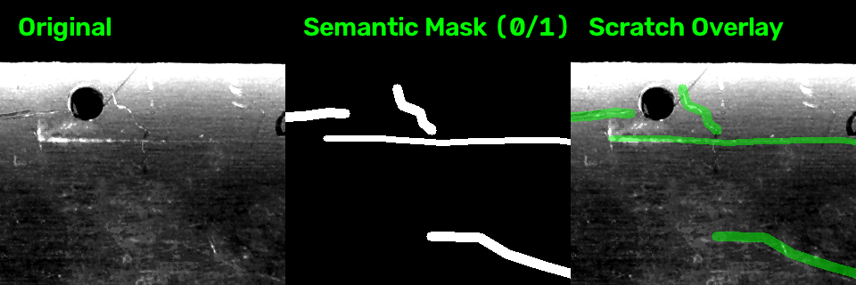
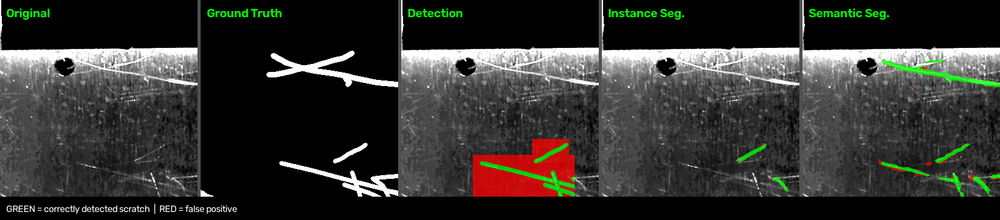

# YOLO26-basierte Kratzererkennung

In diesem Repository werden drei YOLO26-basierte Ansätze zur Kratzererkennung untersucht:

- **Objektdetektion**
- **Instanzsegmentierung**
- **Semantische Segmentierung**

Alle Ansätze verwenden dieselben Ausgangsbilder und Kratzermasken. Die grundlegenden Funktionen für **Datensatzerstellung, Training und Prediction** stehen für jede Methode separat unter `src/` zur Verfügung.

---

## Datenvorverarbeitung

Die Ausgangsbilder werden zunächst in **Trainings-, Validierungs- und Testdaten im Verhältnis 70/20/10** aufgeteilt. Anschließend werden Bilder und Masken in überlappende **320 × 320 px Tiles** mit **20 % Überlappung** zerlegt.

Je nach YOLO-Methode werden aus denselben Kratzermasken unterschiedliche Trainingslabels erzeugt:

| Methode | Label |
|---|---|
| **Detektion** | Bounding Boxes um zusammenhängende Kratzerbereiche |
| **Instanzsegmentierung** | Polygone entlang der Kratzerkonturen |
| **Semantische Segmentierung** | Pixelweise Maske mit `0 = Hintergrund` und `1 = Kratzer` |

Die Datensätze werden mit folgenden Skripten erzeugt:

- [`generate_dataset_tiled_det.py`](src/generate_dataset_tiled_det.py) → `dataset_tiled/`
- [`generate_dataset_tiled_seg.py`](src/generate_dataset_tiled_seg.py) → `dataset_tiled_seg/`
- [`generate_dataset_tiled_sem.py`](src/generate_dataset_tiled_sem.py) → `dataset_tiled_sem/`

Die unterschiedlichen Labelrepräsentationen werden direkt aus den vorhandenen Masken abgeleitet. 
### Kontrolle der erzeugten Labels

Für jeden Datensatz werden automatisch Kontrollbilder unter `dataset.../control/` erzeugt. Sie ermöglichen eine schnelle visuelle Überprüfung der erzeugten Labels.

**Detektion**


Darstellung: `Original | Maske | Bounding Boxes`

**Instanzsegmentierung**


Darstellung: `Original | Maske | Segmentation Polygons`

**Semantische Segmentierung**


Darstellung: `Original | Semantic Mask (0/1) | Scratch Overlay`

---

## Training und Anwendung

Für die drei Ansätze stehen jeweils eigene Trainings- und Prediction-Skripte zur Verfügung:

| Methode | Training | Prediction |
|---|---|---|
| Detektion | [`train_det.py`](src/train_det.py) | [`predict_image_det.py`](src/predict_image_det.py) |
| Instanzsegmentierung | [`train_seg.py`](src/train_seg.py) | [`predict_image_seg.py`](src/predict_image_seg.py) |
| Semantische Segmentierung | [`train_sem.py`](src/train_sem.py) | [`predict_image_sem.py`](src/predict_image_sem.py) |

Bei der Anwendung auf vollständige Bilder erfolgt die Prediction wiederum tilebasiert. Die einzelnen Tile-Ergebnisse werden anschließend auf das Gesamtbild zurückgeführt.

Bei der **Detektion** werden überlappende Bounding Boxes mittels Non-Maximum Suppression zusammengeführt. Bei **Instanz- und semantischer Segmentierung** werden die Masken aus überlappenden Tiles über ein Voting-Verfahren kombiniert. 
---

## Evaluation

Die drei trainierten Ansätze werden mit

[`evaluate_models.py`](src/evaluate_models.py)

auf demselben Testdatensatz miteinander verglichen.

Als gemeinsame Ground Truth werden die pixelweisen Masken aus

```text
dataset_tiled_sem/masks/test/
```

mit

```text
0 = Hintergrund
1 = Kratzer
```

verwendet.

Dadurch können alle drei Verfahren auf Pixelebene miteinander verglichen werden.



Bewertet werden unter anderem:

- Precision und Recall
- Dice / F1
- Intersection over Union (IoU)
- Anteil erkannter Kratzerpixel
- zusätzliche falsch-positive Pixel
- Inferenzzeit

Die Evaluation erzeugt automatisch qualitative Vergleichsbilder unter `test_results/`.

Die **semantische Segmentierung zeigte dabei die stärksten Ergebnisse für die pixelgenaue Kratzerlokalisierung**. Daher wird das Modell

```text
yolo26n_320_sem_scratch
```

für die weiterführende Evaluation verwendet.
